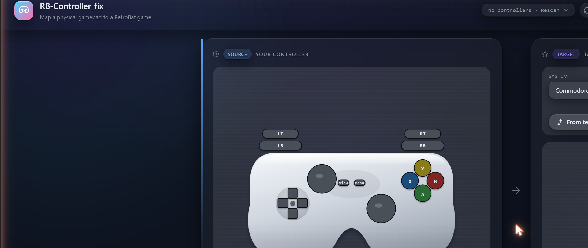
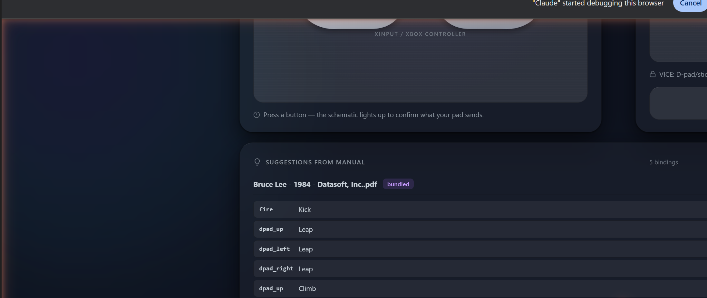
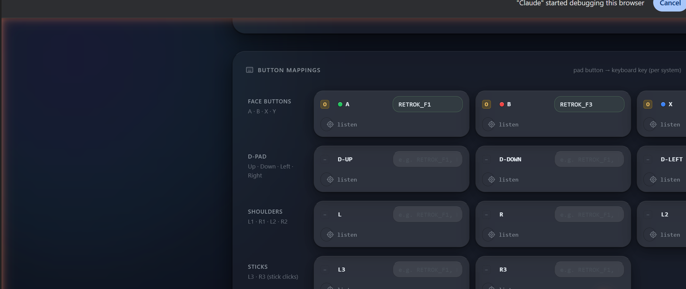
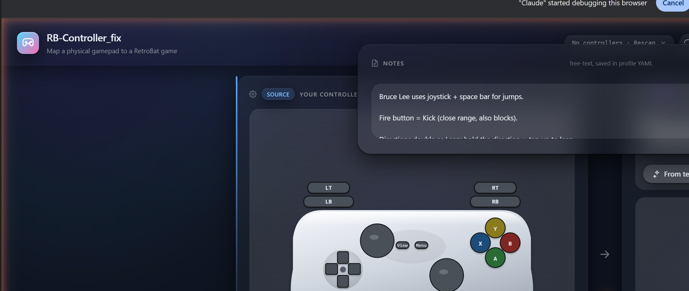

# RetroControlMapper

**Stop configuring controls from scratch.** Ships with a bundled database of **14,047 button mappings across 5,272 retro games**, surfaced as one-click suggestions in the GUI — plus fixes for RetroBat's per-game-options, GUID-drift, and bezel-crop sharp edges.

<!-- screenshot: gui/img/icon/RetroControlMapper_256.png -->

---

## The problem

RetroBat is a great front-end, but its controller pipeline has a few sharp edges:

- **You start from scratch for every new game.** Open the manual, find the controls section, look up `RETROK_*` constants, type each binding into the GUI by hand. Multiply by your library.
- **Per-game core options aren't actually honoured by the launcher** — your tweaks get clobbered every time you start a game.
- **Controllers "disappear" between sessions.** The same physical pad presents under different SDL GUIDs depending on USB port / Bluetooth pairing / dongle re-pair / driver update, and RetroBat keys its autoconfig on that GUID. Mappings vanish mysteriously.
- **Bezels sometimes crop the viewport,** hiding parts of the screen behind decorative artwork.

RetroControlMapper fixes all four.

---

## Features

- **5,272 games come with suggested bindings out of the box.** A bundled bindings database — **14,047 button mappings across 47 systems**, extracted from real game-manual PDFs by a hybrid OCR + regex + local-LLM pipeline. Most popular titles open with one-click *"Apply this suggestion"* — no more configuring controls from scratch. Surfaced in the **💡 Suggestions popover** in the GUI's top-right toolbar, with source chips (bundled / arcade / LLM-extracted / your own contribution) and confidence ratings per binding.
- **Drop a PDF to extract bindings for any game.** Don't see your game in the suggestions? Drag the manual onto the Suggestions popover — local pypdf extraction (no OCR install needed on your end) pulls candidate bindings into the same review UI.
- **Contribute back to the community.** Tick *"Submit my approved bindings to the community DB on Save Profile"* — the app builds a pre-filled GitHub Issue with your bindings JSON and opens it in your browser. The project maintainer triages contributions into the next release's bundled DB. No accounts, no upload-on-your-behalf — every submission is a conscious click in your browser.
- **Sleek 5-icon toolbar.** Non-controller UI collapses into a card-styled toolbar in the top-right (💡 Suggestions, ⌨ Mappings, 🎚 Overrides, 📄 Notes, ⚙ Settings). Each opens a popover. Each has an *"Always keep visible"* pin toggle that drops the panel inline below the controllers if you prefer the old always-visible layout. Count badges show how many bindings/overrides are set at a glance.
- **200+ system dropdown** — every system from your local RetroBat install, automatically discovered.
- **30+ verified per-system defaults** for popular systems: NES, SNES, Genesis / Mega Drive, Game Boy / GBA, N64, PSX, Saturn, Dreamcast, MAME, Neo Geo, CPS, C64, Amiga 500/1200/CD32, Atari ST, ZX Spectrum, and more. These are the click-across-locked baselines the bindings DB layers suggestions on top of.
- **Side-by-side controller view** — your physical pad on the left, the target system's controller on the right, both lighting up live as you press buttons. Curated SVGs for the popular systems; **schematic auto-generated for the long tail** so you never see an empty pane no matter what system you pick.
- **Per-game and per-system overrides** — set sensible defaults for a whole system, then override individual games where it matters.
- **Profile templates per genre** — start a new game from a curated template (Menu-heavy C64, Joyport-1 Boulder Dash, CD32 default, mouse-driven Amiga, etc.) instead of a blank form.
- **Press-to-bind keystrokes** — click the 🎯 listen icon on any binding row, tap the keyboard key you want, done. No more typing `RETROK_F1` by hand.
- **Click-across binding** for systems where RetroBat's default mapping is unreliable — press a physical button to arm it, click any target button to write a per-game RetroArch input remap. The curated systems keep their verified defaults; you only customise where you need to.
- **User-tunable accent** — swap the brand colour to whatever you like (blue / red / purple / mint / …) without changing the whole theme.
- **Test-launch button** — save a profile, click Test, and the game launches in RetroBat with your bindings live. Iterate fast.
- **Controller-image sharing** — `rbcf submit-controller` cleans up a photo, drops it in the catalog, and prints the PR-creation URL. Community grows the library.
- **Community profile pull** — `rbcf pull-community` fetches curated profiles from the GitHub repo so you don't have to author from scratch for popular games.
- **GUID alias detection** — fixes the "my controllers keep forgetting their settings" bug by recognising when the same physical pad has shown up under multiple SDL GUIDs (USB vs Bluetooth, port hop, dongle re-pair, driver swap) and folding all the aliases into a single mapping.
- **Bezel viewport calibration** — recovers cropped game screens by rewriting the bezel `.info` sidecars with a stricter transparency threshold than RetroBat's auto-detect.
- **Tray-resident** — closes to the system tray instead of quitting; tray menu controls Show/Hide and Quit, and an optional "run at Windows startup" toggle.
- **Search-online lookup** for unknown systems' bindings — only fires after you click the button, no consent caching.
- **Two-tier backups** — a permanent pre-install snapshot of your RetroBat config, plus rolling per-edit working snapshots; restore from any of them.
- **Light / Dark / Auto theme** — frosted-acrylic visual design with translucent layered panels. (More themes — tactical, synthwave, paper — land in v0.2.)
- **Pre-build smoke gate.** v0.1.6 onwards: every release build runs a 9-case end-to-end test that loads the bundled DB and verifies real ROM filenames produce non-zero suggestions. Codified after v0.1.5 shipped its headline feature 0%-functional. Won't happen again.
- **Seamless in-place upgrades.** v0.1.5.x → v0.1.6 auto-migrates the user-data folder (legacy `RB-Controller_fix` → `RetroControlMapper`) on first launch. Profiles, snapshots, settings, caches all carry over without intervention.

---

## Install

> **Current version: v0.1.6** ([changelog](CHANGELOG.md)).

1. Download `RetroControlMapper_0.1.6_setup.exe` from the [latest release](https://github.com/ITViking-FIN/RetroControlMapper/releases/latest).
2. Run the installer. The setup wizard will offer to back up your current RetroBat settings — **leave this on, it's free insurance**.
3. Optionally let the installer add a "Run at Windows startup" entry so the GUID watcher can keep your controller mappings stable in the background.

**System requirements**

- Windows 10 or Windows 11 (64-bit).
- RetroBat installed somewhere on disk. The installer auto-detects via the registry and a handful of common paths; if you've got it in an unusual location, you can point the app at it after first run.

---

## First run

1. Look for the gamepad icon in your system tray. **Right-click → Show window** (or just double-click the icon) to open the configuration UI in your default browser.
2. The first-run wizard takes a quick look around — it confirms the RetroBat install path it found, lists the systems and ROMs you have, and offers to scaffold sensible default profiles for any games it doesn't already cover.
3. Plug in a controller and click its button — you should see the live press indicator light up in the source pane. From there, pick a system and game from the dropdowns and start tweaking.

---

## Screenshots

| Default view | 💡 Suggestions popover |
|---|---|
|  |  |
| **⌨ Mappings popover** | **📄 Notes popover** |
|  |  |

(Captured live against C64 + *Bruce Lee*. Suggestion bindings come from
the bundled manual-extraction DB — **5,272 games across 47 systems**,
14,047 button mappings.)

## Quick links

- **[Feature list](FeatureList.md)** — scannable one-line inventory of everything the app does.
- **[Full instruction manual](INSTRUCTIONS.md)** — every screen, every setting, plus troubleshooting and an FAQ.
- **[Report a bug](https://github.com/ITViking-FIN/RetroControlMapper/issues)** — please include the version (`0.1.6`), your Windows version, and a description of what you expected versus what happened.
- **[Latest release](https://github.com/ITViking-FIN/RetroControlMapper/releases/latest)** — installers and release notes.

---

## Privacy

RetroControlMapper reads your RetroBat install and writes config files there. That's it.

- **No telemetry.** We don't track usage, send analytics, or phone home on startup.
- **No accounts.** There's nothing to sign in to.
- **Outbound network requests are gated behind explicit consent** and only fire for two things:
  - **Update check** — your call. Defaults to off until you click "Check now". Caches the result for 24 hours; only ever hits the GitHub releases API for this project.
  - **System lookup** — when you ask the app to search online for an unknown system's controller bindings. Asks every time. Consent is **not** cached — you'll get the prompt on each lookup.

The two-tier backup feature also stores snapshots of your RetroBat config under `%APPDATA%\RetroControlMapper\` so you can roll back any change.

---

## License

**GPL-3.0** — see [LICENSE](LICENSE) for the full text. This is a copyleft license: forks and redistributions must remain open-source under the same terms.

---

## Credits

Built by [ITViking-FIN](https://github.com/ITViking-FIN).

Standing on the shoulders of:

- [RetroBat](https://www.retrobat.org) — the front-end this tool exists to help.
- [libretro / RetroArch](https://www.libretro.com) — the cores.
- The community that keeps the retro platforms alive.

Controller artwork is original and bundled with the app.
